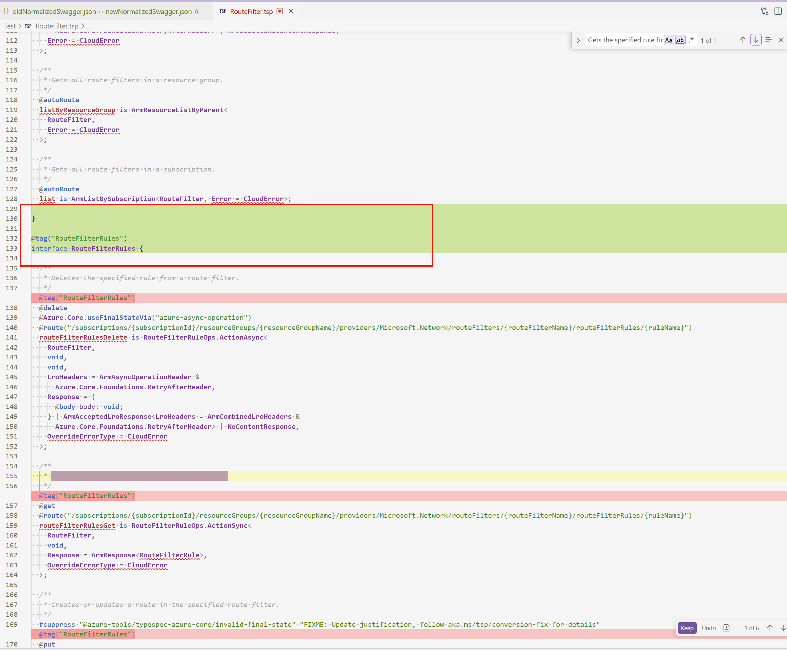

# Plain Agent

## GPT 5.3 Codex

### Output

Split the original one Interface into two Interfaces in order to leverage the way tags added by the Interface.

### Result
Failed to remove extra tags with ths most proper way.

From the swagger view, the swagger compiled from typespec is acceptable. 

But it is not the best practice to do this only for the tags fix consideration.
