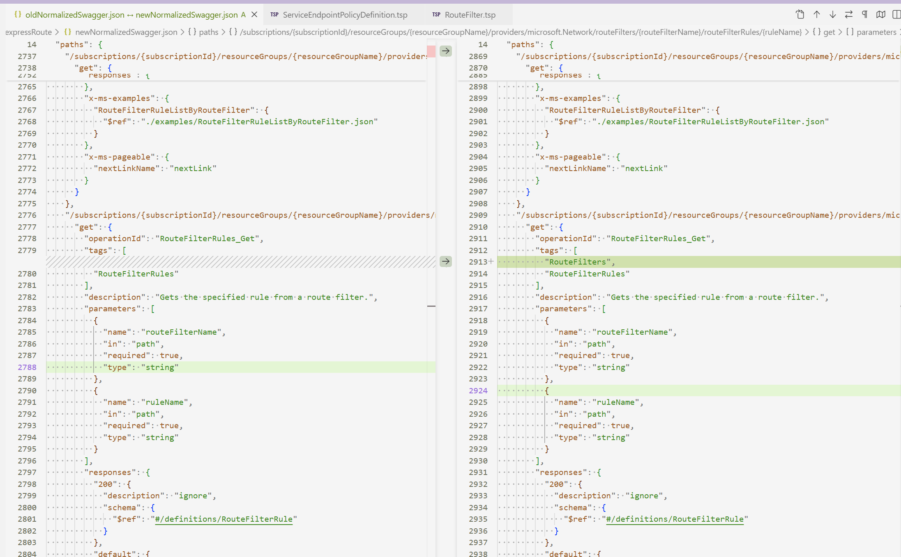

# CASE Remove extra tags

## prompt

Use azure-typespec-author to compare newNormalizedSwagger.json with oldNormalizedSwagger.json, identify any newly introduced tags, trace them back to the corresponding TypeSpec definitions, and remove them at the TypeSpec level.

## Description

We want to  use azure-typespec-author to compare newNormalizedSwagger.json with oldNormalizedSwagger.json, identify any newly introduced tags, and remove the extra tags from the new swagger.



### Input code
[Code Files](Attach)

## Expected output 

find the extra tags in the oldNormalizedSwagger.json and locate on the releated typesspec operation then fix the typespec code.
Specific fix method woud be like as below:

``` ts
@armResourceOperations(#{ allowStaticRoutes: true, omitTags: true })
interface RouteFilters {
  /**
   * Gets the specified rule from a route filter.
   */
  @tag("RouteFilterRules")
  @get
  @route("/subscriptions/{subscriptionId}/resourceGroups/{resourceGroupName}/providers/Microsoft.Network/routeFilters/{routeFilterName}/routeFilterRules/{ruleName}")
  routeFilterRulesGet is RouteFilterRuleOps.ActionSync<
    RouteFilter,
    void,
    Response = ArmResponse<RouteFilterRule>,
    OverrideErrorType = CloudError
  >;
}

```

That means:  
1. `omitTags: true` would be added to the `@armResourceOperations(#{ omitTags: true })` to omit the tags added by the Interface automatically.

2. Then add the actual tags on the opeartion like `@tag("RouteFilterRules")`