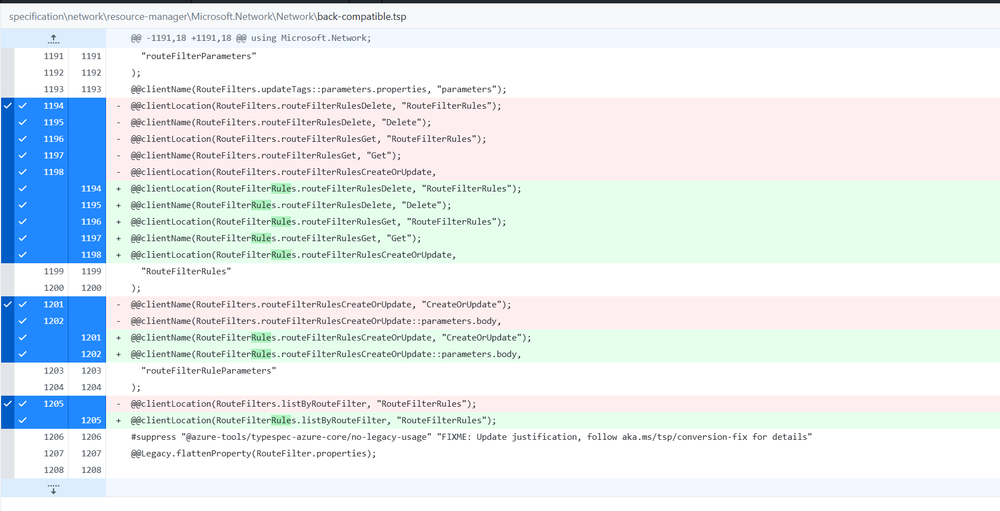
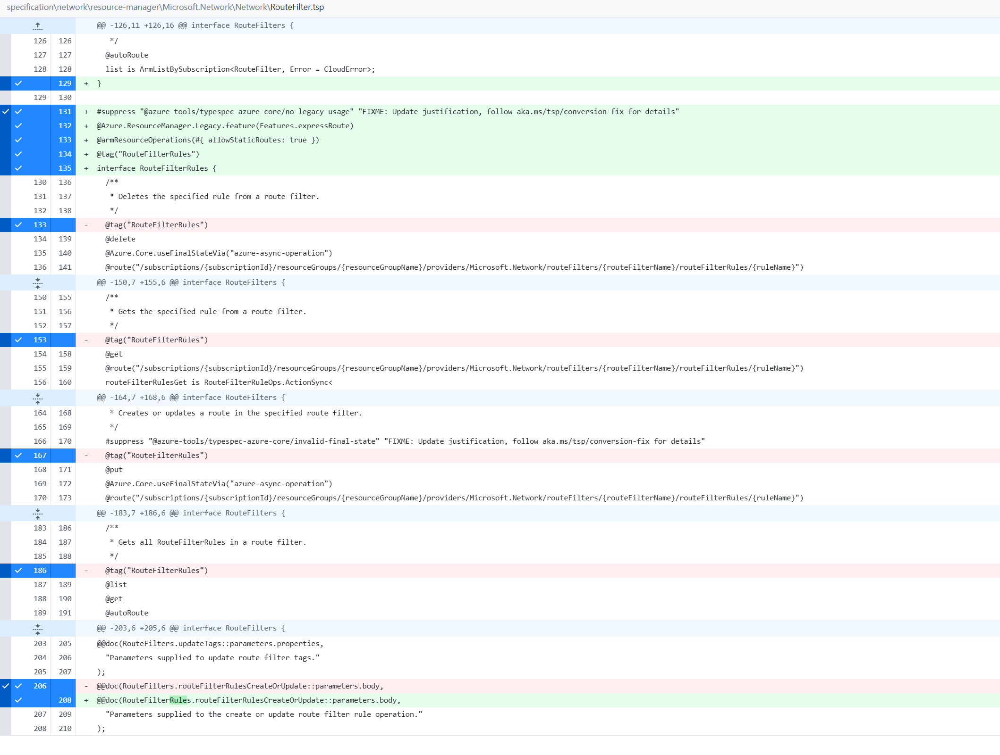
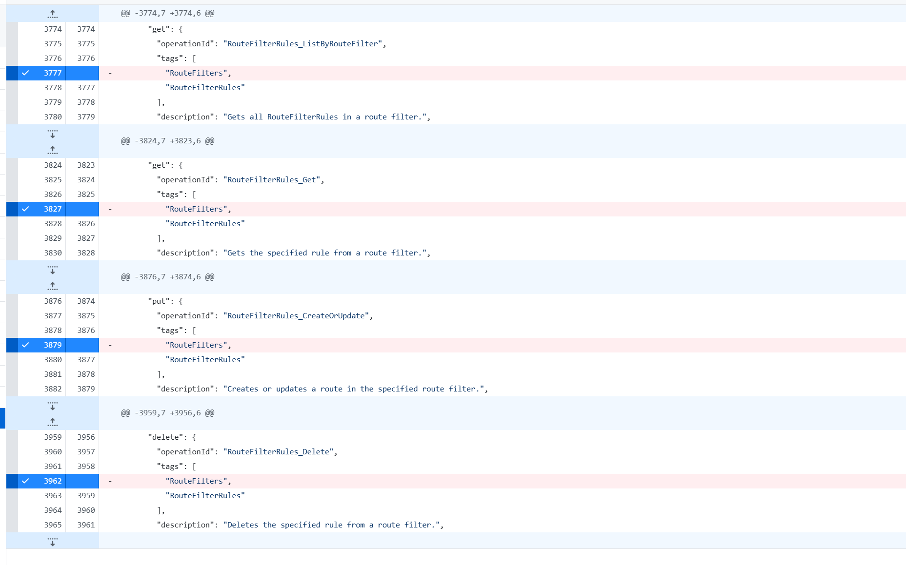
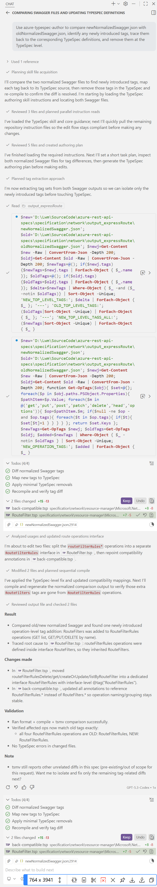

# Plain Agent

## GPT 5.3 Codex

### Output

Did not do the right fix. From the swagger view, it solved the problems. But it is not the best way.
The best way is add:  `@armResourceOperations(#{ allowStaticRoutes: true, omitTags: true })` then add the right @tag decorator in the specific operation.

### Result
Failed to find extra tags.

**not proper changes **

### Conversion details

