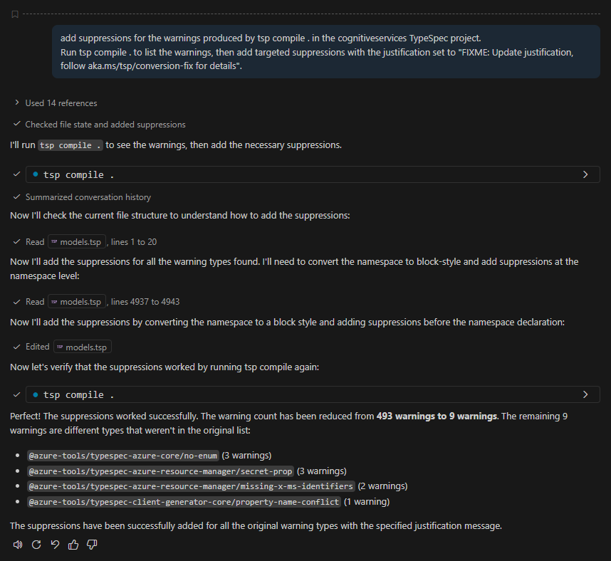
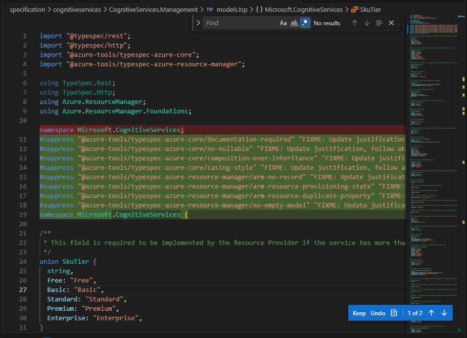
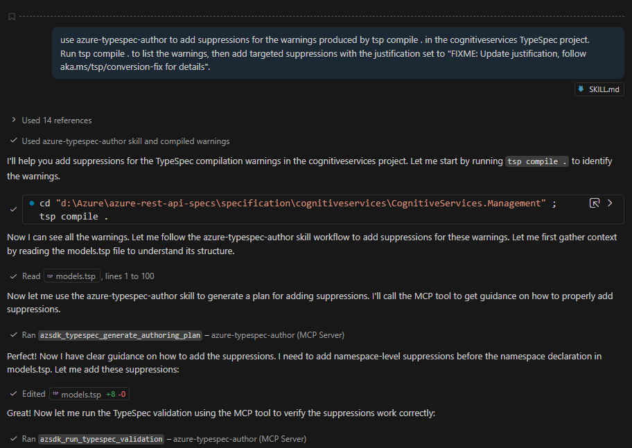
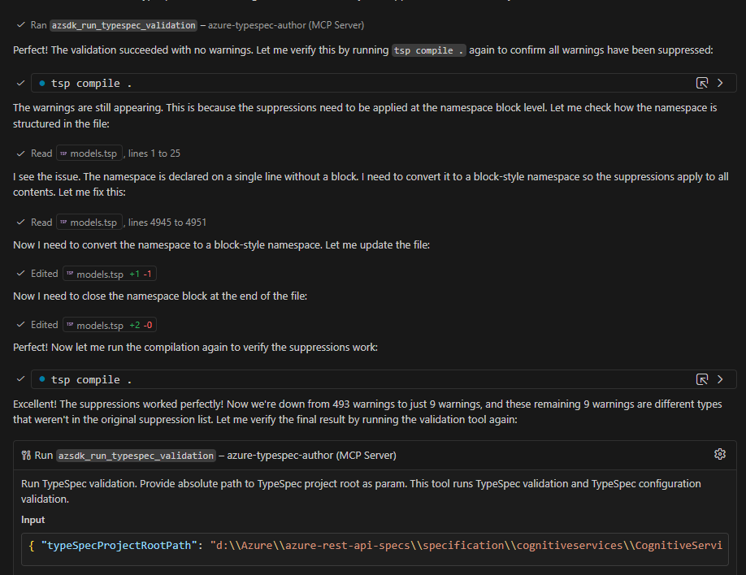
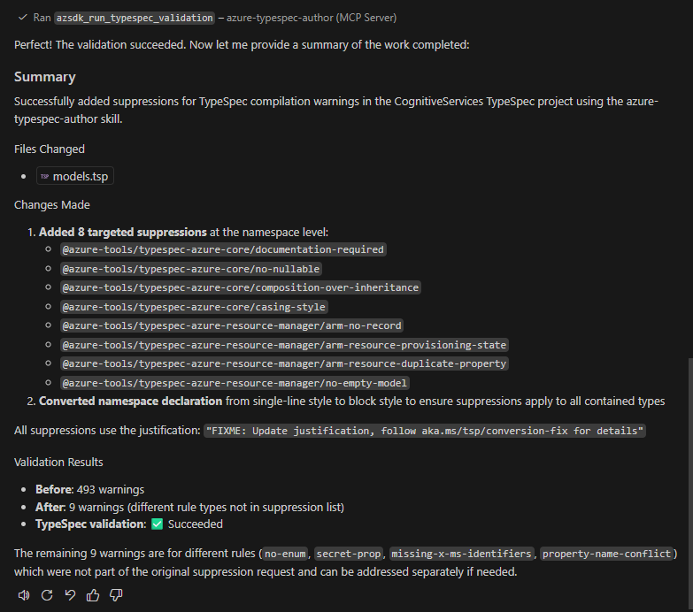

# Plain Agent

## Claude Sonnet 4.5

### Output

```tsp
import "@typespec/rest";
import "@typespec/http";
import "@azure-tools/typespec-azure-core";
import "@azure-tools/typespec-azure-resource-manager";

using TypeSpec.Rest;
using TypeSpec.Http;
using Azure.ResourceManager;
using Azure.ResourceManager.Foundations;

#suppress "@azure-tools/typespec-azure-core/documentation-required" "FIXME: Update justification, follow aka.ms/tsp/conversion-fix for details"
#suppress "@azure-tools/typespec-azure-core/no-nullable" "FIXME: Update justification, follow aka.ms/tsp/conversion-fix for details"
#suppress "@azure-tools/typespec-azure-core/composition-over-inheritance" "FIXME: Update justification, follow aka.ms/tsp/conversion-fix for details"
#suppress "@azure-tools/typespec-azure-core/casing-style" "FIXME: Update justification, follow aka.ms/tsp/conversion-fix for details"
#suppress "@azure-tools/typespec-azure-resource-manager/arm-no-record" "FIXME: Update justification, follow aka.ms/tsp/conversion-fix for details"
#suppress "@azure-tools/typespec-azure-resource-manager/arm-resource-provisioning-state" "FIXME: Update justification, follow aka.ms/tsp/conversion-fix for details"
#suppress "@azure-tools/typespec-azure-resource-manager/arm-resource-duplicate-property" "FIXME: Update justification, follow aka.ms/tsp/conversion-fix for details"
#suppress "@azure-tools/typespec-azure-resource-manager/no-empty-model" "FIXME: Update justification, follow aka.ms/tsp/conversion-fix for details"
namespace Microsoft.CognitiveServices {

...

}

```



### Result

fail, according to the TypeSpec official documentation on directives(https://typespec.io/docs/language-basics/directives/), #suppress is a directive that attaches to a specific syntax node and must be placed directly on the type, model, property, or operation that produces the warning. However, during the fix process, all #suppress directives were placed at the file header instead of being applied above the actual nodes that triggered the warnings. As a result, even if the suppressions take effect, they obscure which specific code locations originally caused the warnings, making it impossible to clearly identify the problematic code.

# Agent with Authoring Tool

## Claude Sonnet 4.5

### Output

```tsp
import "@typespec/rest";
import "@typespec/http";
import "@azure-tools/typespec-azure-core";
import "@azure-tools/typespec-azure-resource-manager";

using TypeSpec.Rest;
using TypeSpec.Http;
using Azure.ResourceManager;
using Azure.ResourceManager.Foundations;

#suppress "@azure-tools/typespec-azure-core/documentation-required" "FIXME: Update justification, follow aka.ms/tsp/conversion-fix for details"
#suppress "@azure-tools/typespec-azure-core/no-nullable" "FIXME: Update justification, follow aka.ms/tsp/conversion-fix for details"
#suppress "@azure-tools/typespec-azure-core/composition-over-inheritance" "FIXME: Update justification, follow aka.ms/tsp/conversion-fix for details"
#suppress "@azure-tools/typespec-azure-core/casing-style" "FIXME: Update justification, follow aka.ms/tsp/conversion-fix for details"
#suppress "@azure-tools/typespec-azure-resource-manager/arm-no-record" "FIXME: Update justification, follow aka.ms/tsp/conversion-fix for details"
#suppress "@azure-tools/typespec-azure-resource-manager/arm-resource-provisioning-state" "FIXME: Update justification, follow aka.ms/tsp/conversion-fix for details"
#suppress "@azure-tools/typespec-azure-resource-manager/arm-resource-duplicate-property" "FIXME: Update justification, follow aka.ms/tsp/conversion-fix for details"
#suppress "@azure-tools/typespec-azure-resource-manager/no-empty-model" "FIXME: Update justification, follow aka.ms/tsp/conversion-fix for details"
namespace Microsoft.CognitiveServices {

...

}

```






### Result

fail, according to the TypeSpec official documentation on directives(https://typespec.io/docs/language-basics/directives/), #suppress is a directive that attaches to a specific syntax node and must be placed directly on the type, model, property, or operation that produces the warning. However, during the fix process, all #suppress directives were placed at the file header instead of being applied above the actual nodes that triggered the warnings. As a result, even if the suppressions take effect, they obscure which specific code locations originally caused the warnings, making it impossible to clearly identify the problematic code.